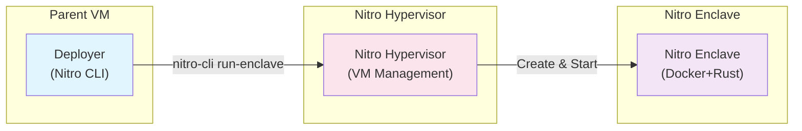
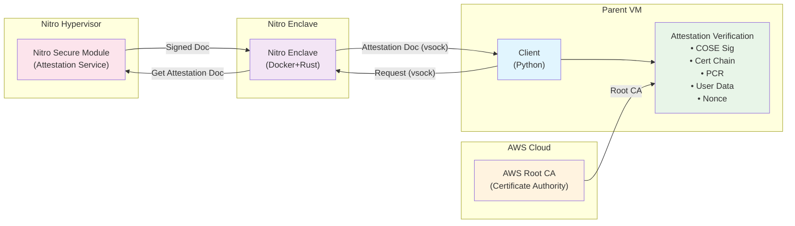
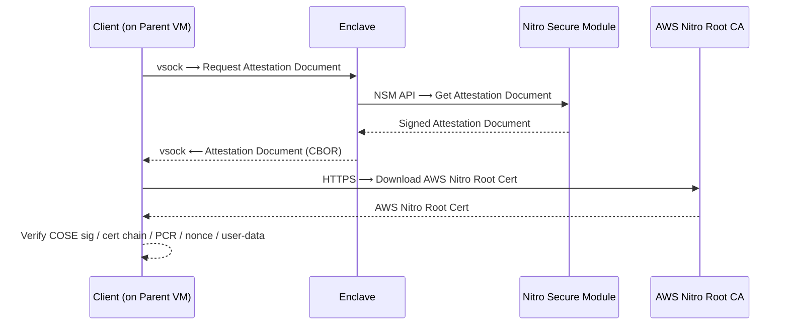

# AWS Nitro Enclaves RA Tutorial

## Introduction

*AWS Nitro Enclaves* provides a container-level isolated environment using software (a hypervisor) rather than hardware.

When a VM with Nitro Enclaves enabled (called the *parent VM*) is created, a portion of the parent VM's resources (CPU/memory) can be carved out and allocated to deploy a *Nitro Enclave*, which is a VM with restricted I/O.

A Nitro Enclave is not isolated by memory encryption, but by access control from a hypervisor called the *Nitro Hypervisor*. This prevents compromise from the parent VM. However, unlike VM-based TEEs such as SEV-SNP and TDX, the Hypervisor must be fully trusted.

The I/O of a Nitro Enclave is strictly limited, with only communication with the parent VM via vsock (VM socket) being permitted. Therefore, to communicate with the outside world, a proxy must be set up within the parent VM.

A Nitro Enclave is prepared in the form of a Dockerfile. A Nitro Enclave image is generated from the Docker image using the Nitro CLI. When deploying a Nitro Enclave image via the Nitro CLI, the Nitro Hypervisor launches the Nitro Enclave by carving out resources from the parent VM and leasing them to the Nitro Enclave.

### Note: Test Environment
This tutorial has been tested in the following environment (parent VM):

- Instance: AWS — m6a.xlarge
- CPU: AMD EPYC 7R13 Processor
- Memory: 16 GiB
- OS: Ubuntu 24.04.1
- Kernel: 6.14.0-1014-aws
- Storage Size: 64 GiB
- Nitro Enclaves CLI: v1.4.3

## Deploy a parent VM with Nitro Enclaves

Unlike SEV-SNP/SGX/TDX, Nitro Enclaves is a hardware-independent isolation feature. So there is a high degree of freedom in the available processors. However, the following minimum requirements exist.

- Virtualization: AWS Nitro-based
- Minimal vCPUs: 4 (Intel/AMD) or 2 (AWS Graviton (ARM64))
- OS: Linux or Windows (≥ 2016)

For more details, see [AWS Nitro Enclaves User Guide](https://docs.aws.amazon.com/enclaves/latest/user/nitro-enclave.html#nitro-enclave-reqs) and [AWS Nitro System Dicumentation](https://docs.aws.amazon.com/ec2/latest/instancetypes/ec2-nitro-instances.html).

### Create an EC2 instance from the Web Console
On AWS, you can set up a Nitro Enclaves enabled VM via the Web Console.

#### Region/Zone
Available in many regions/zones. For complete list, see [AWS Nitro Enclaves User Guide](https://docs.aws.amazon.com/enclaves/latest/user/nitro-enclave.html#nitro-enclave-considerations).

In this tutorial, we perform in **US East (Ohio)**.

#### Application and OS Images (Amazon Machine Image)
Linux or Windows (≥ 2016).

We here use **Ubuntu 24.04**. 

- AMI: Ubuntu Server 24.04 LTS
- Architecture: 64-bit (x86)

Note that using **Amazon Linux** simplifies the setup process of Nitro CLI significantly.

#### Instance type
Select any instance type that supports Nitro Enclaves.

Since enclaves are deployed by rending resources of the parent VM, we recommend to select an instance size with sufficiently large memory size (e.g. 16GiB).

Here, we use **m5.xlarge** (Intel Xeon 8175M or 8259CL, 4 vCPU and 16GiB memory) or **m6a.xlarge** (AMD EPYC 7R13, 4 vCPU and 16GiB memory).

#### Key Pair/Network/Storage
Configure as usual.

Note that if you are using SSH to connect to the VM, the connection may fail if the file access permissions of the generated SSH private key are left as they were at the time of download. You can resolve this by tightening the access permissions with the following command.

```bash
chmod 400 $YOUR_PRIVATE_KEY
```

#### Advanced details (Important)
If you have selected the correct region, zone, OS image, and instance type, the setting item

- Nitro Enclave

will be displayed. Set this to

- Nitro Enclave: Enabled

Note that AWS Nitro Enclaves is not compatible with VM-based TEE (SEV-SNP).

## Setup Nitro Enclaves CLI
Install the Nitro Enclaves CLI on the parent VM. It is available by default on the Amazon Linux AMI, but on Linux distributions such as Ubuntu, it must be installed manually. This is a tedious process as it requires building everything yourself, including the device drivers.

Here we use `./setup-pvm.sh`.

```bash
# Install dependencies, Nitro Enclaves Driver and CLI
USERNAME=<username> ./setup-pvm.sh

# Reboot
sudo reboot
```

**Note**: If you see a message like "Please run 'source /etc/profile.d/nitro-cli-env.sh' to setup the environment or add it your local shell configuration" during the execution of `setup-pvm.sh`, you can safely ignore it. The script already sources the environment file and adds it to `~/.bashrc` for persistence, so no additional action is required.

### Allocation Setting
Next, check and change (if necessary) the resource allocation settings for the Nitro Enclave.

```bash
cat /etc/nitro_enclaves/allocator.yaml
```

The default values are as follows:

```yaml
memory_mib: 512
cpu_count: 2
```

This tutorial has been confirmed to work with the default values, but if you run out of memory in later steps, please adjust them as appropriate.

### Run Nitro Enclaves Allocator Service

```bash
sudo systemctl start nitro-enclaves-allocator.service
sudo systemctl enable nitro-enclaves-allocator.service
```

## Remote Attestation — Quick Start

### 1. Setup Client Environment

```bash
# Install system dependencies and Python packages for client
./setup-client.sh
```

### 2. Build Nitro Enclave

```bash
# Build the Nitro Enclave
./build.sh
```

After successful build, *note the PCR values from stdout:*

```json
{
  "Measurements": {
    "HashAlgorithm": "Sha384 { ... }",
    "PCR0": "346f022d41b1e2cee79968ef56c891fdf7732d233389dfe5897c412c788e659add58ec635b26a785f545ba2e91e4d943",
    "PCR1": "0343b056cd8485ca7890ddd833476d78460aed2aa161548e4e26bedf321726696257d623e8805f3f605946b3d8b0c6aa",
    "PCR2": "25aa92de6d44e32c32ed4cc05983cff112dd0005984a939b1249e43c6239a0a345406c2f31d6369391cbc130896cb97b"
  }
}
```

### 3. Run Nitro Enclave

```bash
# Start the Nitro Enclave
./run.sh
```

### 4. Configure Expected Measurements

Create or update `client/expected-measurements.json` with the reference PCR values from step 2:

```json
{
  "Measurements": {
    "HashAlgorithm": "Sha384 { ... }",
    "PCR0": "346f022d41b1e2cee79968ef56c891fdf7732d233389dfe5897c412c788e659add58ec635b26a785f545ba2e91e4d943",
    "PCR1": "0343b056cd8485ca7890ddd833476d78460aed2aa161548e4e26bedf321726696257d623e8805f3f605946b3d8b0c6aa",
    "PCR2": "25aa92de6d44e32c32ed4cc05983cff112dd0005984a939b1249e43c6239a0a345406c2f31d6369391cbc130896cb97b"
  }
}
```

### 5. Download AWS Nitro Root Certificate

```bash
# Download AWS Nitro Enclaves root certificate
./get-ca.sh
```

### 6. Run Attestation Verification

```bash
# Execute attestation verification
./attest.sh
```

### 7. Cleanup

```bash
# Terminate the enclave when done
./cleanup.sh
```

### Output Files

After running attestation verification, the following files are generated:

- `client/attestation-document.dat`: Raw attestation document (base64 encoded CBOR)
- `client/attestation-document-json.json`: Parsed JSON attestation document

## Remote Attestation — Details

### Architecture

#### Deployment Phase



#### Attestation Phase



### Attestation Verification Flow

The attestation verification process consists of several steps:

1. **Request Attestation Document**: Client (on the parent VM) connects to the enclave via vsock and requests an attestation document, which includes the certificate chain
2. **Parse CBOR Document**: Extract JSON report data from the CBOR-formatted attestation document
3. **Verify COSE Signature**: Validate the COSE signature using the leaf certificate from the attestation document
4. **Verify Certificate Chain**: Validate the certificate chain from leaf certificate to root certificate (AWS Nitro CA)
5. **Verify PCR Values**: Compare PCR values against expected measurements
6. **Verify User Data and Nonce**: Ensure user data and nonce match the original request



### Platform Configuration Registers
Nitro TPM provides Platform Configuration Registers (PCRs) that measure various components of the enclave and parent VM. The following table lists all available PCRs and indicates which ones are verified in this tutorial:

| PCR | What's measured | Verified |
| :- | :- | :- |
| 0 | Enclave image | ✅ |
| 1 | Kernel and boot ramfs | ✅ |
| 2 | Application | ✅ |
| 3 | IAM role of the parent VM | - |
| 4 | Instance ID of the parent VM | - |
| 8 | Enclave image signing certificate | - |

In analogy with Intel SGX, PCR0 and PCR8 correspond to MRENCLAVE and MRSIGNER, respectively.

### Verification Results

The system performs comprehensive verification:

- ✅ **COSE Signature**: Verified using ECDSA-SHA384
- ✅ **Certificate Chain**: Full chain validation from leaf to root
- ✅ **PCR Values**: Match expected (reference) measurements
- ✅ **User Data**: Matches original request
- ✅ **Nonce**: Matches original request

## Troubleshooting

### Common Issues

1. **Enclave not running**: Ensure `./build.sh` and `./run.sh` completed successfully
2. **Connection refused**: Check if enclave is running with `nitro-cli describe-enclaves`
3. **PCR mismatch**: Verify `expected-measurements.json` contains correct PCR values
4. **Certificate errors**: Ensure `client/root.pem` is properly downloaded and placed

### Debug Commands

```bash
# Check enclave status
nitro-cli describe-enclaves

# View enclave logs
sudo cat /var/log/nitro_enclaves/nitro_enclaves.log

# Check if virtual environment is activated
source venv/bin/activate
```

## Security Features

- **Cryptographic Verification**: Full ECDSA-SHA384 signature validation
- **Certificate Chain Validation**: Complete trust chain verification
- **Platform Integrity**: PCR value verification ensures enclave integrity
- **Freshness**: Nonce verification prevents replay attacks
- **Data Integrity**: User data verification ensures request authenticity

## References
- AWS Nitro Enclaves - User Guide - What is Nitro Enclaves? <https://docs.aws.amazon.com/enclaves/latest/user/nitro-enclave.html>
- AWS Nitro Enclaves - User Guide - Nitro Enclaves concepts <https://docs.aws.amazon.com/enclaves/latest/user/nitro-enclave-concepts.html>
- AWS Nitro Enclaves - User Guide - Verifying the root of trust <https://docs.aws.amazon.com/enclaves/latest/user/verify-root.html>
- AWS Nitro Enclaves - User Guide - Cryptographic attestation <https://docs.aws.amazon.com/enclaves/latest/user/set-up-attestation.html>
- Amazon EC2 - Instances built on the AWS Nitro System <https://docs.aws.amazon.com/ec2/latest/instancetypes/ec2-nitro-instances.html>
- Amazon EC2 - NitroTPM for Amazon EC2 instances <https://docs.aws.amazon.com/AWSEC2/latest/UserGuide/nitrotpm.html>
- AWS - Nitro Enclaves Command Line Interface (Nitro CLI) <https://github.com/aws/aws-nitro-enclaves-cli>
- AWS - Nitro Secure Module library <https://github.com/aws/aws-nitro-enclaves-nsm-api>
- AWS - Nitro Enclaves Samples <https://github.com/aws/aws-nitro-enclaves-samples>
- VSOCK: Introduce VM Socket (Commit d021c34) <https://github.com/torvalds/linux/commit/d021c344051af91f42c5ba9fdedc176740cbd238>