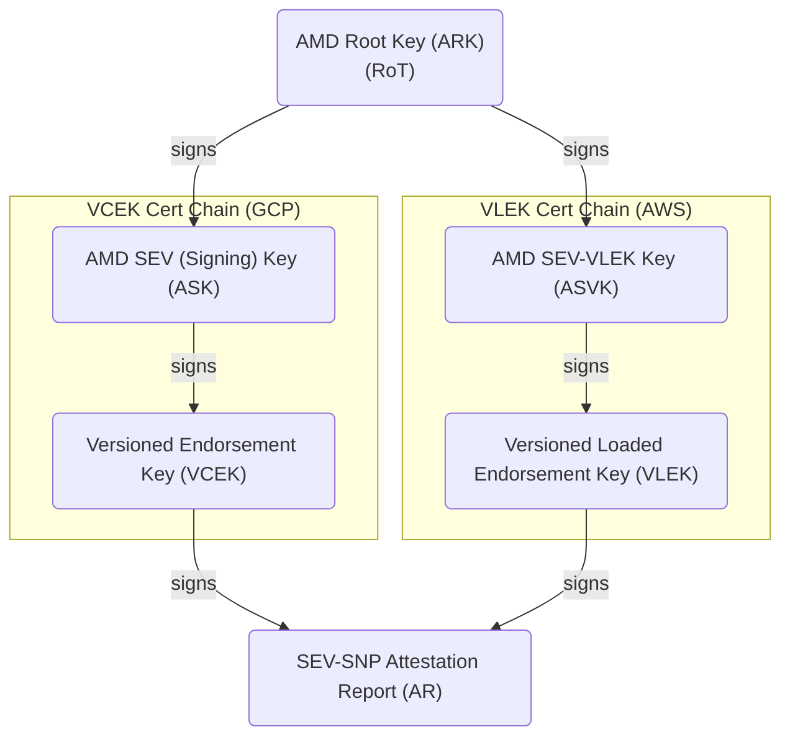
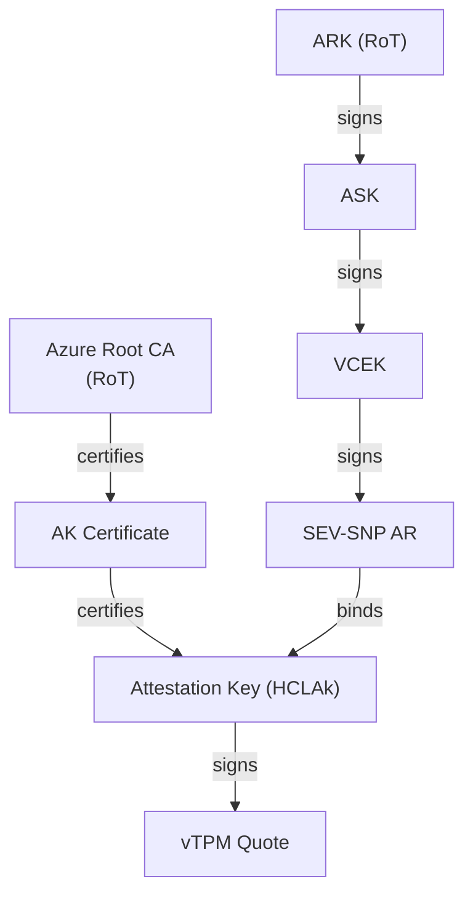
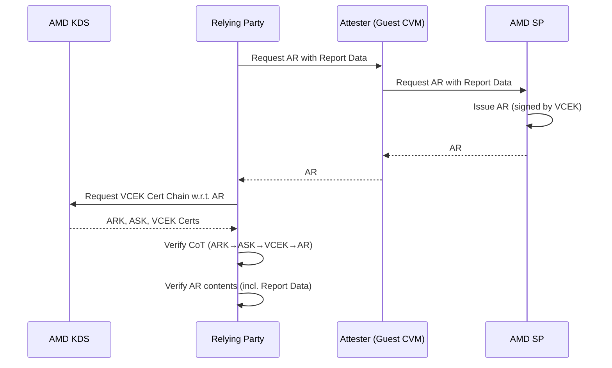
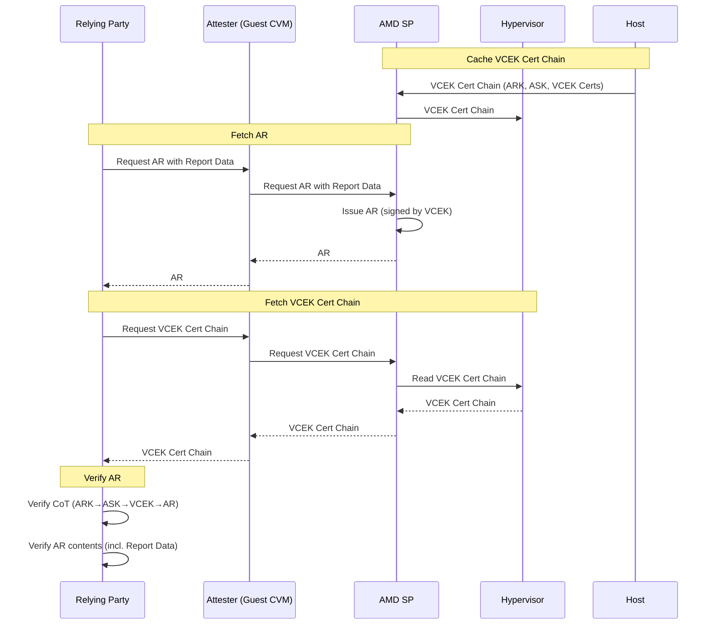
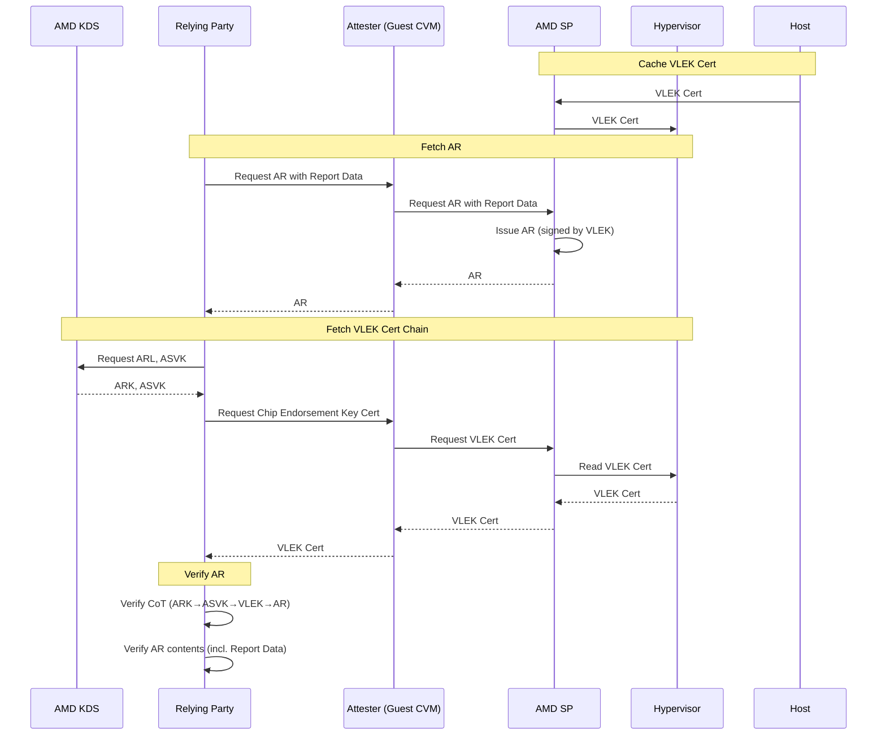
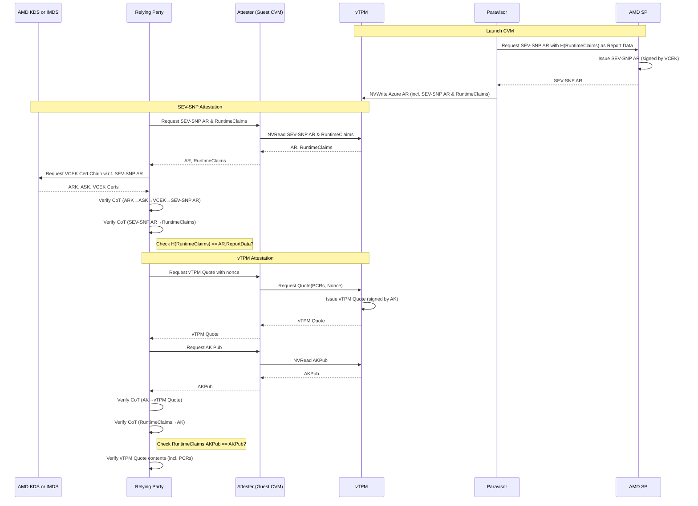
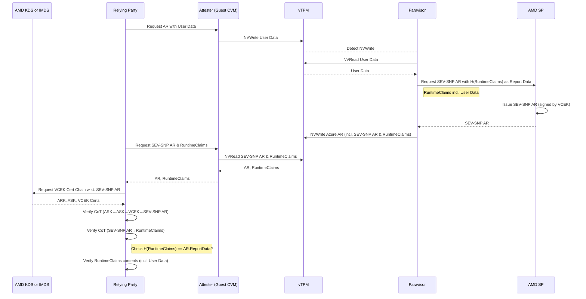

# About SEV-SNP Remote Attestation
[Index](./index.md)

AMD SEV-SNP (Secure Encrypted Virtualization - Secure Nested Paging) protects a virtual machine (VM) by encrypting not only its disk but the entire VM, including memory and registers. This prevents even the host administrator from stealing data or code within the VM.

Remote Attestation (RA) is a process where the guest OS (Attester) cryptographically proves to a remote user (Relying Party) that it is running in a correctly protected environment. By trusting the chip vendor (AMD), the Relying Party can be assured through RA that the target VM is running in a genuine AMD SEV-SNP environment.

## Chain of Trust
The Remote Attestation of an SEV-SNP CVM consists of verifying the following Chain of Trust (CoT). There are two types of CoT depending on the type of private key used to sign the Attestation Report (AR).

Unlike other SEV-SNP CVMs, Azure CVMs presuppose a unique RA workflow using a vTPM. The CoT is as follows.

## Remote Attestation Protocol
The Relying Party verifies the authenticity of the AR presented by the CVM based on the VEK certificate chain distributed by AMD. (This reduces the trust to the AMD RoT.) Then, by verifying the contents of the AR such as the Measurement (hash value), Report Data, and SVN, the Relying Party confirms requirements including integrity. (Also, by including a nonce in the Report Data, the freshness of the AR is ensured.)

## Extended Remote Attestation Protocol
In Extended Attestation, the host caches a part or the whole of the VEK certificate chain, and the Relying Party uses the host-cached VEK certificate chain for verification.

### Caching the entire VCEK certificate chain (GCP)

### Caching only the VLEK certificate (AWS)

### Note
An Extended AR is an AR with the host-cached VEK certificate (or certificate chain) appended to the end, which can be retrieved from the AMD-SP for verification in Extended Attestation.

However, the current `snpguest` does not implement a function to fetch an Extended AR in a single step, so the AR and the VEK certificate (chain) must be retrieved separately. Therefore, in the sequence diagrams above, the fetching of the AR and the VEK certificate (chain) are shown as separate actions.

Note that `go-sev-guest` supports getting an Extended AR, so the AR and the VEK certificate (chain) can be fetched at once.

## Remote Attestation for Azure CVM via vTPM
In Azure CVMs, the AMD-SP is hidden from the guest OS, and it is not possible to obtain an SEV-SNP AR (directly) from the AMD-SP at runtime. Instead, a Remote Attestation Workflow using a vTPM is assumed.

In an Azure CVM, a paravisor (OpenHCL) is placed at VMPL0 of the guest VM, and the guest OS is placed at a lower privilege level. (This protects the paravisor from malicious **guests**.) A vTPM is included as a module within the paravisor. The guest OS cannot interact directly with the SEV-SNP guest device and must do so through the vTPM.

When the CVM is launched, the paravisor requests a SEV-SNP AR from the AMD-SP and stores it in the vTPM's non-volatile storage (NVS) at NV index `0x01400001`. A hash of the Runtime Claims is bound to the AR as Report Data. The Runtime Claims is a JSON object consisting of the AK public key (used for vTPM Quote signature verification), the EK public key (encryption key), VM configuration information, and User Data (zero-filled by default). The Runtime Claims itself is also stored at NV index `0x01400001`.

The following sequence diagram shows the RA from SEV-SNP to vTPM when using the AR generated at boot time.

This first extends the TCB from the AMD-SP to the paravisor (including the vTPM) by verifying the SEV-SNP AR, and then extends it to the entire workload by verifying the vTPM Quote (including PCR verification).

Since the SEV-SNP AR generated at CVM boot time cannot bind Report Data specified by the Relying Party or Attester, performing only this RA does not eliminate the possibility of replay attacks. On the other hand, since a nonce can be bound to the vTPM Quote, the vTPM Quote cannot be replayed.

Note that writing 64 bytes of data to NV index `0x01400002` will be detected by the paravisor, which will then read NV index `0x01400002`, use this as User Data in the new Runtime Claims to re-fetch an SEV-SNP AR, and overwrite NV index `0x01400001`. Therefore, when performing SEV-SNP RA alone, you can bind the Report Data to the SEV-SNP AR via the vTPM to ensure freshness.

However, it is important to note that this only actually guarantees that the paravisor is running in an SEV-SNP environment and that the guest VM is a proxy for the paravisor. It does not guarantee that the guest VM itself is in an SEV-SNP environment.

