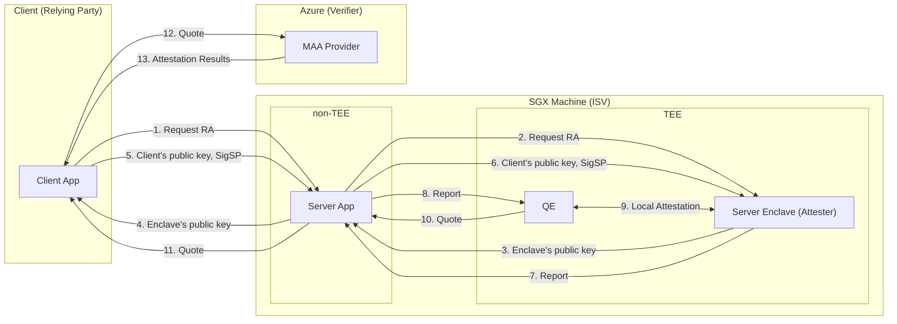
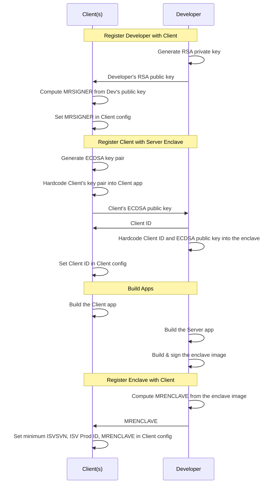
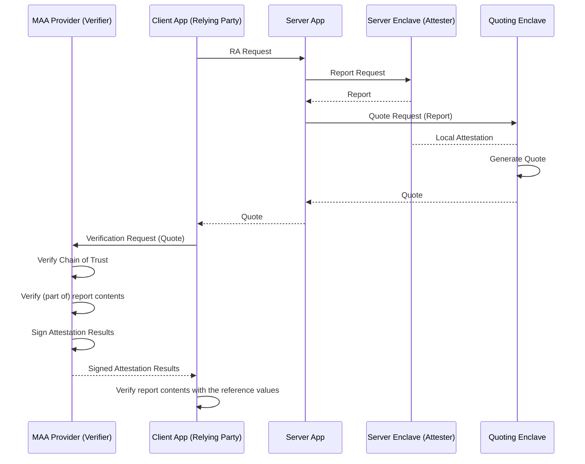
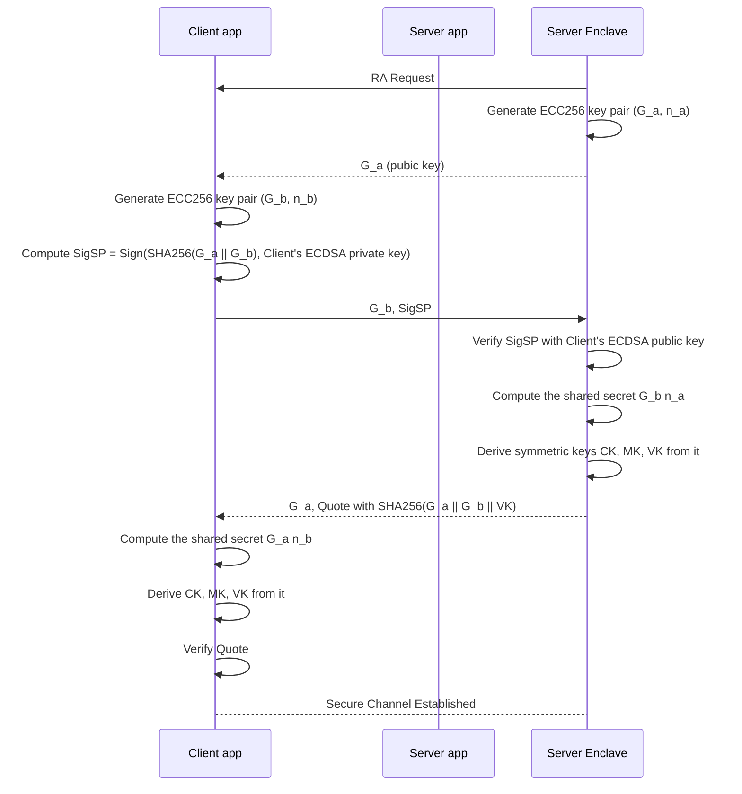
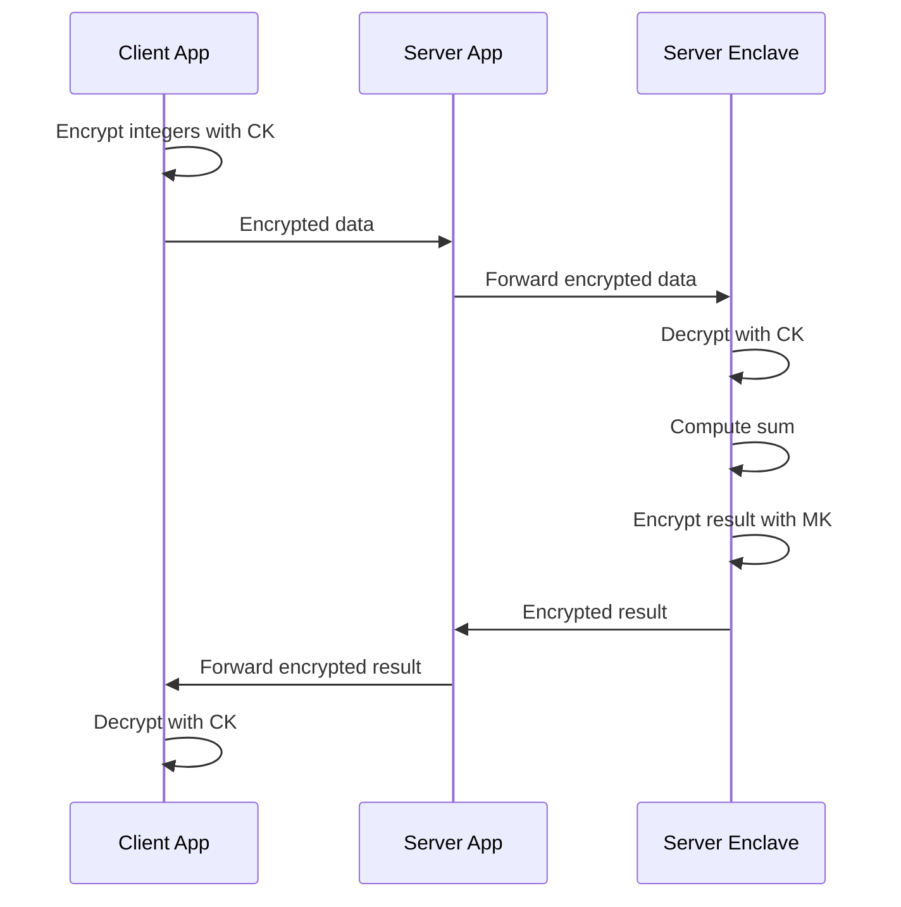

# Azure SGX RA Tutorial

## Introduction

This guide walks through deploying an **Server Enclave (Attester)** on an Azure **SGX-enabled VM**, running a separate **Client (Relying Party)** on the same VM (or another host if you want), and performing **ECDSA-based (DCAP) Remote Attestation** (alongside ECDH Key Exchange) using Humane-RAFW-MAA Library.

### Note: Test Environment
This tutorial has been tested in the following environment:

- Instance: Microsoft Azure — Standard DC2sv3
- CPU: Intel(R) Xeon(R) Platinum 8370C CPU
- Memory: 16 GiB
- OS: Ubuntu 24.04.1
- Kernel: 6.14.0-1012-azure
- Storage: 30 GiB
- Linux SGX Libraries: ver 2.26.100
- DCAP Libraries: ver 1.23
- Humane-RAFW-MAA: main (`df3c5eb`)

## Create an SGX enabled VM

This section explains how to create an SGX-enabled VM in the Azure portal. The information below is based on the situation as of November 2025.

### Region/Availability zone

Select a region/zone that allows you to choose a [size family that supports SGX](#size-family). You can search from the Azure CLI with the following command (for DC2sv3).

```bash
az vm list-skus \
  --size Standard_DC2s_v3 \
  --all \
  --query "[?name=='Standard_DC2s_v3']"
```

This tutorial has been confirmed to work in **Japan East / Zone 3** .

### Security type

- Trusted launch virtual machines
  - Secure boot: Enabled \[default: Enabled\] 
  - vTPM: Enabled (fixed)
  - Integrity monitoring: Enabled or Disabled \[default: Disabled\]

### Image (OS image)

Here, we will use one of the following OSes.
- Ubuntu 24.04 LTS - all plans including Ubuntu Pro
	- Ubuntu Server 24.04 LTS - x64 Gen 2
	- Ubuntu Pro 24.04 LTS - x64 Gen 2

### Size family

The following size families support SGX.

| Size Family | Processor | SGX Capable |
| :--- | :--- | :--- |
| DCsv2 | Intel Xeon E-2288G (Coffee Lake) \[x86-64\] | ⚠️ |
| DCsv3 | Intel 3rd Gen Xeon (Ice Lake) \[x86-64\] | ✅ |
| ECdsv3 | Intel 3rd Gen Xeon (Ice Lake) \[x86-64\] | ✅ |

Note that **DCsv2** (supporting EPID-based RA) will be retired on June 30, 2026.

In this tutorial, we use **DC2sv3** (with 2 vCPUs and 16GiB memory).

### Other Settings
These do not affect the enabling of SGX, so you can configure them as you like.

## Quick check: verify that SGX is enabled

After the VM boots, you can confirm that the kernel SGX driver is active and the hardware feature is available with the following one-liners. Run the following command on the VM.

```bash
# 1. Kernel log – should list at least one EPC section
sudo dmesg | grep -i sgx

# 2. Device nodes
ls -l /dev/sgx_enclave /dev/sgx_provision

# 3. CPU flags
lscpu | grep -i sgx
```

If all three commands show the expected output (driver messages, device nodes, and the `sgx` CPU flag), the platform is ready for SGX application and quote generation. Otherwise verify that you selected an SGX capable size family.

### Heads-up for older kernels
Linux OS images based on a **Linux kernel earlier than 5.11** do **not** ship the in-tree SGX driver. In that case you must build and load [SGX Linux Driver for DCAP](https://github.com/intel/SGXDataCenterAttestationPrimitives/tree/main/driver/linux) manually. After loading the modules, re-run the the second verification command above to confirm `/dev/sgx_enclave` and `/dev/sgx_provision` are present.

### Note
The success of the above commands does not mean true verification; it merely involves checking for kernel messages, interfaces, and CPU flags that should exist when SGX is enabled. True verification will be established with remote attestation.

## Setup VM

### Install Dependencies
```bash
sudo apt update

# for SGX SDK
sudo apt install -y build-essential ocaml ocamlbuild automake autoconf libtool wget python-is-python3 libssl-dev git cmake perl unzip

# for SGX PSW (without duplication)
sudo apt install -y libcurl4-openssl-dev libprotobuf-dev protobuf-compiler debhelper libboost-dev libboost-system-dev libboost-thread-dev

# for DCAP (without duplication)
sudo apt install -y pkgconf protobuf-c-compiler libprotobuf-c-dev
```

The list above covers the common toolchain. Depending on your distribution or kernel version you may be prompted for additional packages. If a later build step fails with a "command not found" or missing header, simply install the indicated package with apt and re-run the step.

### Add `sgx` group to the current user

Add permission to access SGX.

```bash
# Check systemd version
systemctl --version

# Add sgx/sgx_prv group if version >= 248
sudo groupadd sgx
sudo groupadd sgx_prv

sudo usermod -a -G sgx $USER
sudo usermod -a -G sgx_prv $USER

# Reboot VM
sudo reboot

# Confirm that the current user is included in sgx and sgx_prv
groups
```

### Linux SGX
Install Linux SGX SDK and Platform Software (PSW) following the [Linux SGX Documentation](https://github.com/intel/linux-sgx/blob/main/README.md).

```bash
# Clone Linux SGX and prepare
git clone https://github.com/intel/linux-sgx
cd linux-sgx
make preparation
```

#### SGX SDK

```bash
# Build SGX SDK installer
make sdk
make sdk_install_pkg
# => ./linux/installer/bin/sgx_linux_x64_sdk_${VERSION}.bin

VERSION="2.26.100.0" # Replace it with the actual version

# Install SGX SDK
SGX_PACKAGES_PATH="/opt/intel"

./linux/installer/bin/sgx_linux_x64_sdk_${VERSION}.bin
# Note: When running the installer, it will prompt "Do you want to install in current directory? [yes/no]". Choose "no" and press Enter, and provide the installation path (SGX_PACKAGES_PATH).

# Persist SGX SDK environment
source $SGX_PACKAGES_PATH/sgxsdk/environment
echo "source $SGX_PACKAGES_PATH/sgxsdk/environment" >> ~/.bashrc
```

#### SGX PSW
Install SGX PSW using the local repository rather than a manual build. This will automatically resolve dependencies.

```bash
# Set Intel GPG key
wget -qO - https://download.01.org/intel-sgx/sgx_repo/ubuntu/intel-sgx-deb.key | \
sudo gpg --dearmor -o /usr/share/keyrings/intel-sgx-keyring.gpg

echo "deb [arch=amd64 signed-by=/usr/share/keyrings/intel-sgx-keyring.gpg] https://download.01.org/intel-sgx/sgx_repo/ubuntu $(lsb_release -cs) main" | \
sudo tee /etc/apt/sources.list.d/intel-sgx.list

# Update apt package index
sudo apt update

# Install SGX PSW
sudo apt install libsgx-dcap-ql libsgx-quote-ex libsgx-headers
```

#### Sanity check

To verify that SGX SDK and PSW are successfully installed, build and execute Intel's **Local Attestation** sample code bundled with the SGX SDK:

```bash
# Build
# SGX_MODE=HW for SGX native
# SGX_MODE=SIM for simulation
cd "$SGX_SDK/SampleCode/LocalAttestation"
make SGX_MODE=HW

cd bin

# Run responder enclave
./appresponder
# Run initiator enclave (on another terminal)
./appinitiator
# Terminate responder enclave
pkill appresponder

# Or run all-in-one app
./app

# Cleanup
cd ..
make clean
```

On success you should see output similar to:

```console
$ ./appresponder
Server is ON...
Press Ctrl+C to exit...

$ ./appinitiator
succeed to load enclave libenclave_initiator.signed.so
succeed to establish secure channel.
Succeed to exchange secure message...
Succeed to close Session...

$ ./app
succeed to load enclaves.
succeed to establish secure channel.
Succeed to exchange secure message...
Succeed to close Session...
```

#### Troubleshooting

If any of the messages report failure, revisit the previous setup steps before proceeding.

| Symptom | Root cause / Fix |
| --- | --- |
| `connection error, Connection refused` when running **appinitiator** | The responder side (`./appresponder`) is not running or listening on the expected Unix-domain socket. Make sure that `appresponder` is running successfully. |
| `bind error; fail to init server` in **appresponder** / `connection error, Permission denied` in **appinitiator** | A stale socket file `/tmp/UNIX.domain` exists with inappropriate permission/ownership. Remove the file or change ownership:<br/>`sudo rm -f /tmp/UNIX.domain` *or* `sudo chown $USER /tmp/UNIX.domain` |


### SGX DCAP

```bash
git clone --recursive https://github.com/intel/SGXDataCenterAttestationPrimitives
cd SGXDataCenterAttestationPrimitives/
```

#### Quote Generation Library

```bash
cd QuoteGeneration/

# Build Quote Generation Library
./download_prebuilt.sh
make

# Build packages
make deb_pkg

# Install pkgs
cd installer/linux/deb/

sudo dpkg -i libsgx-dcap-ql_*.deb
sudo dpkg -i libsgx-dcap-ql-dev_*.deb
sudo dpkg -i libsgx-dcap-ql-dbgsym_*.ddeb
sudo dpkg -i libsgx-dcap-default-qpl_*.deb
sudo dpkg -i libsgx-dcap-default-qpl-dev*.deb
sudo dpkg -i libsgx-dcap-default-qpl-dbgsym*.ddeb

```

#### Configure PCS/PCCS

Go back to `SGXDataCenterAttestationPrimitives/`. Change PCS/PCCS configs for the Azure environment.

```bash
# Write/overwrite PCS/PCCS config file
sudo cp ./QuoteGeneration/qcnl/linux/sgx_default_qcnl_azure.conf /etc/sgx_default_qcnl.conf

# Display the updated configs
cat /etc/sgx_default_qcnl.conf
# PCS: Intel's PCS
# PCCS: Azure THIM
# Local cache: IMDS (host's cache)

# Restart AESM service
sudo systemctl restart aesmd.service
systemctl status aesmd
```

## Remote Attestation
This section provides a step-by-step instruction of the DCAP-based Remote Attestation procedure for the SGX Enclave within an Azure VM using **Humane-RAFW-MAA** (Humane Intel SGX Remote Attestation Framework for Microsoft Azure Attestation) Library.

### Preparation
#### 1. Clone Humane-RAFW-MAA
```bash
# Clone
git clone https://github.com/acompany-develop/Humane-RAFW-MAA
cd Humane-RAFW-MAA
```

#### 2. Set CA Certs for HTTPS

```bash
# Copy CA Certs for HTTPS
cp /etc/ssl/certs/ca-certificates.crt .
```

#### 3. Generate & Hardcode Client's ECDSA Key Pair

``` bash
cd subtools/client-ecdsa-keygen/

# Build key generator
make

# Run
./keygen
```

The hex-formatted key pair is then generated and displayed:

```console
$ ./keygen

...

Copy the following public keys and hardcode them into Server's Enclave code (ex: server_enclave.cpp):

        {
                0x28, 0xa0, 0xe7, 0xba, 0xd9, 0xbf, 0xf3, 0xdf,
                0x87, 0x45, 0x7c, 0x6d, 0x92, 0xfb, 0x50, 0xe8,
                0xc7, 0x62, 0x9a, 0xdf, 0x9a, 0xcb, 0xe4, 0xf9,
                0xf4, 0x9c, 0x1b, 0x12, 0xd2, 0xd7, 0x5a, 0xe2
        },
        {
                0x98, 0x7c, 0x66, 0x6d, 0xc6, 0xcb, 0x41, 0x2b,
                0x0c, 0x78, 0x62, 0xfe, 0x7e, 0x91, 0x5f, 0x41,
                0x62, 0xf4, 0xb0, 0x8c, 0xec, 0x9a, 0x78, 0x8e,
                0x28, 0x08, 0x22, 0x56, 0xc8, 0x99, 0x14, 0xa5
        }


Copy the following private key and hardcode it into Client's untrusted code (ex: client_app.cpp):

        0x0d, 0x3c, 0x50, 0x1d, 0xda, 0x14, 0xa3, 0xf2,
        0x16, 0x88, 0x74, 0x9e, 0xc1, 0x68, 0x69, 0xb5,
        0x81, 0x34, 0xb6, 0x9e, 0xc2, 0xa4, 0x92, 0x25,
        0x31, 0xd6, 0x5f, 0xf1, 0x96, 0x4d, 0x94, 0xaf
```

Hardcode the output key pair:
- the first block (pubkey) into `client_signature_public_key[0]` (L30-33) in `Server_Enclave/client_pubkey.hpp`.
- the second block (privkey) into `g_client_signature_private_key[]` (L11-22) in `Client_App/client_app.cpp`.

Alternatively, you can use the automated Python script `SGX/update_keys.py` in this Cloud RA Sample repository. The script will automatically generate the Client's ECDSA key pair and hardcode the public and private keys into the appropriate files.

To use the script:
1. Build `subtools/client-ecdsa-keygen/keygen`.
2. Copy `SGX/update_keys.py` from this repository into `Humane-RAFW-MAA/`.
3. Run the script on `Humane-RAFW-MAA/`:
   ```bash
   python update_keys.py
   ```


#### 4. Generate and Hardcode RSA Signing Key

Go back to `Humane-RAFW-MAA/`.

```bash
cd Server_Enclave
openssl genrsa -out private_key.pem -3 3072
```

#### 5. Endpoint settings

By default the sample places both the **Client** and the **SGX Server** on the same (virtual) machine. The server listens on `localhost:1234`. If you need to expose the service on a different address or port, adjust the hard-coded endpoint in `Client_App/client_app.cpp` and `Server_App/server_app.cpp`.

- `Client_App/client_app.cpp`
  ```cpp
  std::string server_url = "http://localhost:1234"
  ```
- `Server_App/server_app.cpp`
  ```cpp
  srv.listen("localhost", 1234);
  ```

#### 6. Set up a Microsoft Azure Attestation (MAA) instance

Quote verification in this library relies on Microsoft Azure Attestation. For anything beyond quick local tests you should deploy your **own** MAA provider rather than the default MAA provider.

Step-by-step instructions are available in [Deploy an Azure Attestation Provider](/Documents/Deploy-MAA-Provider.md).

Once the provider is created, note the **MAA Provider URL** — it will be passed to the client when verifying quotes.

#### 7. Build 

Go back to the root of `Humane-RAFW-MAA/` and build Client and Server apps.

```bash
make
```

#### 8. Compute MRENCLAVE and MRSIGNER

Compute MRENCLAVE and MRSIGNER values of the SGX enclave built.

If you installed SGX SDK in a location other than `/opt/intel/sgxsdk/`, first edit `sdk_path` in `subtools/mr-extract/mr-extract.cpp`:

```cpp
std::string sdk_path = "/opt/intel/sgxsdk/";
```

Build and run `mr-extract`:

```bash
cd subtools/mr-extract
make
./mr-extract
```

Note the outputs as we will be used in the next step.

```console
$ ./mr-extract
-------- message from sgx_sign tool --------
Succeed.
--------------------------------------------

Copy and paste following measurement values into settings.ini.
MRENCLAVE value -> 9aef5c5402636dda33f8a58de618baa034e7956f83e71cb51d458e68e1258a76
MRSIGNER value  -> e5f61479421e24974f3ba0a44ddbe066fe2a629e4e2efbe9c9707bcbe9eff36e
```

#### 9. Client Setting

Edit `settings_client_template.ini` as follows and save it as `settings_client.ini`.

| Field | Value | Description |
| :- | :- | :- |
| `MAA_URL` | See [Step 6](#6-set-up-a-microsoft-azure-attestation-maa-instance) | URL of MAA provider, like `https://***.***.attest.azure.net` |
| `MAA_API_VERSION` | `2025-06-01` (default) | MAA API Version of `Attest Sgx Enclave` |
| `CLIENT_ID` | `0` (default) | The index of the client's public key embedded at [Step 3](#3-generate--hardcode-clients-ecdsa-key-pair)  |
| `MINIMUM_ISVSVN` | `0` (default) | The minimum required ISVSVN (Independent Software Vendor-Security Version Number) |
| `REQUIRED_ISV_PROD_ID` | `0` (default) | Enclave's ID the client requires |
| `REQUIRED_MRENCLAVE` | See [Step 8](#8-compute-mrenclave-and-mrsigner) | MRENCLAVE (the hash digest of the Enclave image) the client expects |
| `REQUIRED_MRSIGNER` | See [Step 8](#8-compute-mrenclave-and-mrsigner) | MRSIGNER (the hash digest of the enclave signer) |
| `SKIP_MRENCLAVE_CHECK` | `0` (default) | — |

Alternatively, you can use the interactive Python script `SGX/generate_settings.py` in this Cloud RA Sample repository. The script will guide you through the configuration process and can automatically extract MRENCLAVE and MRSIGNER values if `mr-extract` is already built.

To use the script:
1. Build `subtools/mr-extract/mr-extract` (see [the previous step](#8-compute-mrenclave-and-mrsigner)) if you want the script to automatically extract measurements.
2. Copy `SGX/generate_settings.py` from this repository into `Humane-RAFW-MAA/`.
3. Run the script on `Humane-RAFW-MAA/`:
   ```bash
   python generate_settings.py
   ```
   The script will prompt you to enter the necessary fields interactively.

### Run

Go back to the root of `Humane-RAFW-MAA/`. We first start running the SGX server:

```bash
# Run SGX Server app
./server_app
```

After confirming that the SGX Server successfully started, we then execute the Client app:

```bash
# Run Client app (on another console)
./client_app
```

### Troubleshooting

| Symptom | Root cause / Fix |
| --- | --- |
| `ERROR: file read error` in **Client** | Check that the config file `settings_client.ini` exists. |
| `ERROR: Unknown error. Probably SGX server is down.` in **Client** | The Server side (`server_app`) is not running or listening on the expected Unix-domain socket. Make sure that `server_app` is running successfully. If the error persists despite `server_app` running, it may be due to an HTTP response timeout. Please attempt to extend the timeout period using the following method. |

#### Extending timeout period
Humane-RAFW-MAA uses the `cpp-httplib` library for communicating between the client app, the server app, and the MAA provider. The client's default timeout period is set to 5 seconds. If server-side processing (e.g. quote generation) takes an extended period, a timeout-related error may occur: `ERROR: Unknown error. Probably SGX server is down.`

To increase the timeout duration, edit the client application source file (typically `Client_App/client_app.cpp`) and add timeout configuration. You can set the timeout in either of the following ways:

**Option 1: Set timeout immediately after initializing the `Client` object:**

```cpp
Client client(server_url);
client.set_read_timeout(60); // 60 seconds
// ... other code ...
auto res = client.Post("/get-quote", request_json, "application/json");
```

**Option 2: Set timeout before the HTTP request:**

```cpp
Client client(server_url);
// ... other code ...
client.set_read_timeout(60); // 60 seconds
auto res = client.Post("/get-quote", request_json, "application/json");
```

You can set the timeout duration using any of the following methods:

```cpp
// by seconds (integer)
client.set_read_timeout(60); // 60 seconds

// using std::chrono duration types (requires #include <chrono>)
client.set_read_timeout(std::chrono::milliseconds(60000)); // 60,000 milli-seconds
client.set_read_timeout(std::chrono::seconds(60)); // 60 seconds
client.set_read_timeout(std::chrono::minutes(1)); // 1 minute
```

After modifying the code, please run `make` again in the `Humane-RAFW-MAA` directory. Only `client_app` will be rebuilt.

## Remote Attestation — Details

The Humane-RAFW-MAA Library performs Remote Attestation integrated with Elliptic Curve Diffie–Hellman (ECDH) key exchange (and Client Authentication). To facilitate understanding, we describe the RA and ECDHKE procedures separately.

In summary, the Remote Attestation process involves the following steps: The client and the server enclave perform the ECDH key exchange. Simultaneously, the server app generates the quote with the hash of the shared session key and MAC as REPORT DATA. The Client then verifies the following data in the Quote:

- **MRENCLAVE**: Ensures that the Enclave image matches the expected one
- **MRSIGNER**: Ensures that the image was built by the expected developer
- **ISVSVN**: Ensures that the Enclave image mitigates known vulnerabilities
- **REPORT DATA**: Prevents MITM attacks during key exchange while preventing Quote replay attacks
- **Certificate chain and quote signature verification (via Microsoft Azure Attestation)**: Ensures the quote's authenticity



### Preparation Phase

1. The client generates an ECDSA key pair for signing public keys.
2. The client's ECDSA private key is hardcoded into the client app code.
3. The pair of the client's ECDSA public key and the client ID is hardcoded into the enclave code. This ensures that the enclave only communicates with pre-registered clients.
4. The enclave's developer (deployer) generates an RSA-3072 private key for signing the enclave image.
5. Build the enclave image and sign it with the enclave signing key.
6. Compute the MRENCLAVE (Measurement Register of ENCLAVE; the SHA256 hash of the enclave image) and the MRSIGNER (Measurement Register of SIGNER; the SHA256 hash of the enclave signing key).
7. Set the expected (reference) ISVSVN, ISV Prod ID, MRENCLAVE, MRSIGNER to the client app.



### Remote Attestation (RA) Procedure

This process enables the client to verify the enclave's authenticity and integrity.

1. **Client App**: Requests Remote Attestation from the Server App (outside TEE).
2. **Server App**: Requests the hardware report from the Server Enclave.
3. **Server Enclave**: Returns the report to the Server App.
4. **The Server App**: Requests a quote from the Third-party Quoting Enclave (QE3) with the received report.
5. **QE3**:
    - Performs Local Attestation with the Server Enclave (verifying that the enclave resides on the same machine).
    - Generates the quote, which includes the quote header, received report, quote signature, Attestation Key (AK) public key and cert, and PCK cert chain.
      - The quote signature is the signature for header + report using the AK private key.
      - The AK key pair is generated by QE3.
      - The AK certificate is issued and signed by the processor using the Provisioning Certification Key (PCK) within the Provisioning Certification Enclave (PCE).
      - The PCK cert chain is fetched from the Azure THIM.
    - Returns the quote to the Server App.
6. **Server App**: Forwards the quote to the Client App. (More precisely, the Server App constructs a request JSON for MAA API `Attest Sgx Enclave` and returns it.)
7. **Client App**: Sends the quote to the MAA Provider.
8. **MAA Provider**:
    - Verifies the quote (incl. the chain of trust).
    - Returns attestation results to the Client App.
      - The attestation results is a JSON Web Token (JWT) signed by the Azure CA.
9. **Client App**: Verifies that the quote and JWT contents (ISVSVN, ISV Prod ID, MRENCLAVE, MRSIGNER, REPORT DATA, etc.) are consistent with the reference values (from the preparation phase).



### Key Exchange Procedure

This process establishes a secure channel between the client and enclave, bound to the attestation.

1. **Client App**: Initiates a key exchange request with the enclave (via the server app).
2. **Server Enclave**:
    - Generates an ephemeral ECC256 key pair `(G_a, n_a)`.
    - Sends its public key `G_a` to the client.
3. **Client App**:
    - Generates its own ephemeral ECC256 key pair `(G_b, n_b)`.
    - Computes the shared secret (DH key) `G_a n_b`.
    - Derives the Key Derivation Key (KDK) from the shared secret.
    - Concatenates the two public keys `G_a || G_b`.
    - Signs this concatenated keys with its hardcoded ECDSA signing key (from the preparation phase). This signature is called `SigSP`.
    - Sends `G_b` and `SigSP` to the enclave.
4. **Server Enclave**:
    - Verifies the signature `SigSP` against `G_a || G_b` with the hardcoded client ECDSA public key (Client Authentication).
    - Computes the shared secret `G_b n_a`.
    - Derives the KDK from the shared secret.
    - Derives VK (for preventing MITM), SK and MK (for the session keys) from KDK as CMACs.
    - Computes the hash `SHA256(G_a || G_b || VK)`.
    - Bind the hash in the REPORT DATA field of the hardware report.
    - The report information is sent to the Client App during the RA procedure.
5. **Client App**:
    - Derives VK, CK and MK from KDK.
    - Calculates `SHA256(G_a || G_b || VK)`.
    - Compares the calculated hash with the REPORT_DATA in the reveived quote.
6. **Handshake Complete**:
    - The Client's authenticity is verified at step 4.
    - The Server Enclave's authenticity is verified via the RA procedure.
    - The Client App and the Server Enclave now use the derived CK and MK for communication encryption.



Since the session keys (ECC256) of the Client App and the Server App and the VK the shared secret are tied with the quote

### Computing

The sample application demonstrates computation in TEE by providing an API for calculating the sum of two 64-bit unsigned integers.

1. **The Client App**:
    - Encrypts two integers using CK with AES128-GCM mode.
    - Sends the encrypted integers to the Server App.
2. **The Server App**: Forwards to the Server Enclave.
3. **The Server Enclave**:
    - Decrypts the received data using CK.
    - Computes the sum of the decrypted integers.
    - Encrypts the result using MK with AES128-GCM mode.
    - Returns the encrypted result to the Server App.
4. **The Server App**: Forwards to the Client App.
5. **The Client App**: Decrypts the response using MK.



## References

### Microsoft Azure
- Microsoft: [Azure Confidential Computing Documentation](https://learn.microsoft.com/en-gb/azure/confidential-computing/)
- Microsoft: [Quickstart: Create Intel SGX VM in the Azure portal](https://learn.microsoft.com/en-us/azure/confidential-computing/quick-create-portal?source=recommendations)
- Microsoft: ['DC' family general purpose VM size series](https://learn.microsoft.com/en-us/azure/virtual-machines/sizes/general-purpose/dc-family?)
- Microsoft: [DCsv2-series retirement](http://learn.microsoft.com/en-us/azure/virtual-machines/sizes/retirement/dcsv2-series-retirement)
- Microsoft: [Trusted Hardware Identity Management](https://learn.microsoft.com/en-us/azure/security/fundamentals/trusted-hardware-identity-management)
- Microsoft: [REST API Spec (Version 2025-06-01) - Attestation - Attest Sgx Enclave](https://learn.microsoft.com/en-us/rest/api/attestation/attestation/attest-sgx-enclave?view=rest-attestation-2025-06-01&tabs=HTTP)

### SGX/TEE
- Intel: [Intel(R) Software Guard Extensions (Intel(R) SGX) — Developer Guide](https://download.01.org/intel-sgx/latest/linux-latest/docs/Intel_SGX_Developer_Guide.pdf)
- Intel: [Intel(R) Software Guard Extensions Data Center Attestation Primitives](https://github.com/intel/SGXDataCenterAttestationPrimitives)
- Microsoft: [Leveraging Attestations with Trusted Execution Environment (TEE) based applications on Azure (and on the Edge) - A starter guide for developers](https://www.microsoft.com/en-us/download/details.aspx?id=101201)
- Acompany: [Humane Intel SGX Remote Attestation Framework for Microsoft Azure Attestation (Humane-RAFW-MAA)](https://github.com/acompany-develop/Humane-RAFW-MAA)
- Acompany: [Intel SGX DCAP RA (in Japanese)](https://www.acompany.tech/privacytechlab/intel-sgx-dcap-ra)

### Others
- yhirose: [cpp-httplib](https://github.com/yhirose/cpp-httplib)