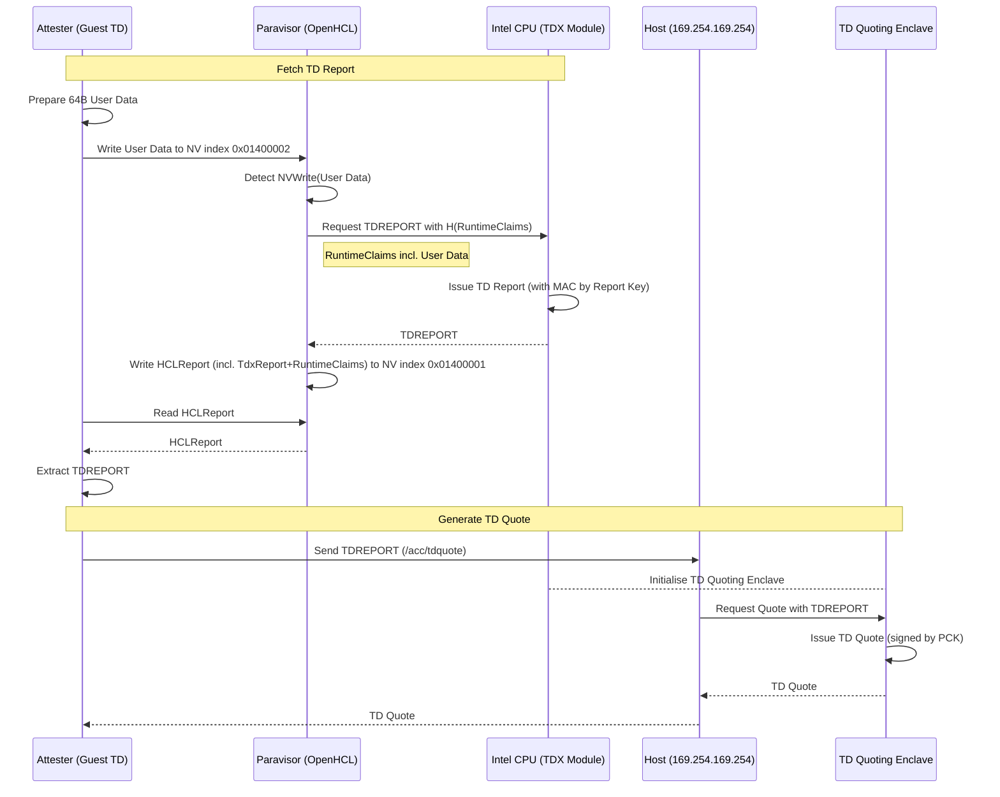

# Azure TDX RA
[Index](./index.md)

This document explains the procedure for setting up a TDX enabled CVM on Microsoft Azure and performing RA.

### Note: Test Environment
This tutorial has been tested in the following environment:

- Instance: Microsoft Azure — Standard DC2esv6
- CPU: Intel 5th Gen Xeon (Emerald Rapids)
- Memory: 8 GiB
- OS: Ubuntu 24.04.1
- Kernel: 6.11.0-1018-azure
- Storage Size: 32 GiB

## Deploy a TDX CVM
This section explains the procedure for deploying a TDX enabled CVM in the Azure portal. The following information is based on the state as of August 2025.

### Create a VM instance from the Web Console

#### Region/Availability zone
Select a region/zone that allows you to choose a [size family that supports TDX](#size-family). You can search from the Azure CLI with the following command (for DC2esv6).

```bash
az vm list-skus \
  --size Standard_DC2es_v6 \
  --all \
  --query "[?name=='Standard_DC2es_v6']"
```

This tutorial has been confirmed to work in **East US**.

#### Security type
- Confidential virtual machines
  - Secure boot: Enabled \[default: Enabled\] 
  - vTPM: Enabled (fixed)
  - Integrity monitoring: Enabled or Disabled \[default: Disabled\]

#### Image (OS image)
Press "See all images". You can narrow down the OS images that can be used with CVMs by applying the "Security Type: Confidential" filter. Here, we will use one of the following OSes.
- Ubuntu 24.04 LTS - all plans including Ubuntu Pro
	- Ubuntu Server 24.04 LTS (Confidential VM) - x64 Gen 2
	- Ubuntu Pro 24.04 LTS (Confidential VM) - x64 Gen 2

#### Size family
The following size families support TDX.

| Size Family | Processor | TDX Capable |
| :--- | :--- | :--- |
| DCedsv5 | Intel 4th Gen Xeon (Sapphire Rapids) \[x86-64\] | ✅ |
| DCesv6 | Intel 5th Gen Xeon (Emerald Rapids) \[x86-64\] | ✅ |
| ECesv6 | Intel 5th Gen Xeon (Emerald Rapids) \[x86-64\] | ✅ |

The available regions differ for each size family. Here, we will use **DC2esv6** with Emerald Rapids, which is available in **US East**. (The **?** in **DC?esv6** is the number of vCPU cores.)

#### Disks
- Confidential OS disk encryption>VM disk encryption: enabled

#### Other Settings
These do not affect the enabling of SEV-SNP, so you can configure them as you like.

## Check if SEV-SNP is enabled
See [How to Check if TDX is Enabled](./Check-TDX-Enabled.md).

### Check for the existence of the vTPM device nodes
Azure CVMs are designed with a Remote Attestation workflow via vTPM in mind. Therefore, we will check if the vTPM is enabled. Run the following on the CVM.

```bash
ll /dev/tpm*
```

If the output is as follows, the vTPM is enabled.

```plaintext
crw-rw---- 1 tss root  10,   224 Jul 24 04:06 /dev/tpm0
crw-rw---- 1 tss tss  253, 65536 Jul 24 04:06 /dev/tpmrm0
```

### Install necessary tools
Install the necessary software on the guest OS of the CVM. For details, see [CVM Environment Setup](./Preparation.md).

## Prepare Microsoft Azure Attestation provider
If you use MAA for verification, see [How to Deploy a Microsoft Azure Attestation Provider](/Documents/Deploy-MAA-Provider.md).

## Remote Attestation
Azure CVMs, regardless of the TEE type, employ a special architecture using a vTPM, and the TEE Guest device is hidden and isolated from the guest OS, so a standard Remote Attestation workflow like on a plain TDX VM cannot be executed. Instead, a special Workflow that interacts with the TDX Guest device using the vTPM as a proxy is required.

The basic design is the same as for SEV-SNP, so for details, see [About SEV-SNP Remote Attestation](/SEV-SNP/Documents/About-SEV-SNP-Remote-Attestation.md). However, in TDX, the procedure for generating a TD Quote (the object to be verified) is more complex. The following is a sequence diagram showing the general procedure up to obtaining a TD Quote. `trustauthority-cli` executes this series of complex procedures internally.



It is noteworthy here that the interaction between the guest and the host is done through an API at the link-local address `169.254.169.254`. This allows for strict restriction and management of communication from the guest to the host. The configuration where the Paravisor proxies the interaction between the guest and the TDX Guest device also has the same effect. It is presumed that this is an attempt to limit the means of attack from the guest to the host.

### 1. Prepare 64-byte user data and nonce
Prepare user data and a nonce to be bound to the TD Quote. Here, we will use random values for both the user data and the nonce.

```bash
openssl rand 64 > user-data.bin
openssl rand 64 > nonce.bin
base64 -w 0 user-data.bin > user-data.txt
base64 -w 0 nonce.bin > nonce.txt
```

### 2. Get TD Quote by `trustauthority-cli`
The TD Quote has a signature and a certificate chain (in PEM format) appended to the end. (This is similar to an extended report in SEV-SNP.)

```bash
sudo trustauthority-cli quote \
    --nonce "$(< nonce.txt)" \
    --user-data "$(< user-data.txt)" \
    --aztdx > ta-out.txt
grep "Quote: " ta-out.txt | sed "s/Quote: //g" | base64 -d > quote.bin
```

Here, `trustauthority-cli quote` indirectly interacts with the TDX Module and the Host OS to generate a TD Quote by executing the following complex flow.

1. **Guest OS requests a TD Report**
    1. Mix the raw user data and nonce and hash it `user_data := SHA512(nonce || rawUserData)` to 64 bytes
    2. Write `user_data`  to NV index `0x01400002`
2. **Paravisor forwards the TD Report request**
    1. Detects the NV write by the Guest
    2. Creates Runtime Claims, which is a JSON consisting of the AK public key, EK public key, VM configuration information (`vm_config`), and `user_data`
    3. Hashes the Runtime Claims `reportData := H(runtimeClaims)`
       - The hash used here seems to be SHA256 by default, but SHA384 or SHA512 may also be used
    4. Requests the TDX Guest Module to issue a TD Report with `reportData`
3. **TDX Guest Module generates a TD Report**
4. **Paravisor forwards the TD Report**
    1. Combines the received TD Report with the Runtime Claims and other metadata (such as TEE type and the algorithm information used to hash the Runtime Claims) to create an HCL Report structure
    2. Write this to NV index `0x01400001`
5. **Guest OS gets the TD Report**
    1. Reads the HCL Report from NV index `0x01400001`
    2. Extracts the TD Report (Byte Offset: 32, Byte Size: 1024) from this
6. **Guest OS requests a TD Quote**
    1. Encodes the TD Report in Base64URL and creates a JSON request body
       ```json
       {
          "report": ...
       }
       ```
    2. Sends this to the API endpoint `/acc/tdquote` at `169.254.169.254`
7. **Host machine generates a TD Quote**
    1. The host receives the request to `169.254.169.254`
    2. Creates a TD Quoting Enclave (which requires SGX)
    3. Sends the received TD Report to the TD QE
    4. The TD QE generates a TD Quote based on the TD Report
    5. The Host encodes the TD Quote in Base64URL and creates a JSON response body
       ```json
       {
          "quote": ...
       }
       ```
    6. Sends this back to the Guest
8. **Guest receives the TD Quote**

### 3. Prepare data to be verified

#### 3.1. Hash Digest of Runtime Claims

```bash
# vTPM NVS Indices
AR_NV_INDEX=0x01400001
USER_DATA_NV_INDEX=0x01400002
AKPUB_NV_INDEX=0x81000003

# OFFSETS & SIZES
RUNTIME_DATA_SIZE_OFFSET=1216
RUNTIME_DATA_OFFSET=1216
RUNTIME_CLAIM_HASH_TYPE_OFFSET=12
RUNTIME_CLAIM_SIZE_OFFSET=16
RUNTIME_CLAIM_OFFSET=20

# Read HCL Report from vTPM NV index
sudo tpm2_nvread -C o $AR_NV_INDEX > ./stored-report.bin

# Read the size of the Runtime Data
RUNTIME_DATA_SIZE=$(od -An -tu4 -N4 -j $RUNTIME_DATA_SIZE_OFFSET stored-report.bin | tr -d ' ')

# Extract the Runtime Data
dd if=stored-report.bin \
	bs=1 \
	skip=$RUNTIME_DATA_OFFSET \
	count=$RUNTIME_DATA_SIZE \
	of=runtime-data.bin \
	status=none

# Read the size of the Runtime Claims
RUNTIME_CLAIM_SIZE=$(od -An -tu4 -N4 -j $RUNTIME_CLAIM_SIZE_OFFSET runtime-data.bin | tr -d ' ')

# Extract the Runtime Claims
dd if=runtime-data.bin \
	bs=1 \
	skip=$RUNTIME_CLAIM_OFFSET \
	count=$RUNTIME_CLAIM_SIZE \
	of=runtime-claims.json \
	status=none

# Read the hash algorithm
RUNTIME_CLAIM_HASH_TYPE=$(od -An -tu4 -N4 -j $RUNTIME_CLAIM_HASH_TYPE_OFFSET runtime-data.bin | tr -d ' ')

case $RUNTIME_CLAIM_HASH_TYPE in
1) HASH="sha256sum";;
2) HASH="sha384sum";;
3) HASH="sha512sum";;
*) echo "Unknown hash algorithm ($RUNTIME_CLAIM_HASH_TYPE)"; exit 1 ;;
esac
echo "Runtime-Claims hash algorithm = $RUNTIME_CLAIM_HASH_TYPE ($HASH)"

# Hash the Runtime Claims
$HASH runtime-claims.json \
	| awk '{print $1}' \
	| xxd -r -p \
	| (dd bs=64 count=1 conv=sync of=runtime-digest.bin status=none)
```

#### 3.2. User Data in Runtime Claims

```bash
jq -r '."user-data"' runtime-claims.json > runtime-claims-user-data.txt
```

### 4. Verify TD Quote by `go-tdx-guest`

This step includes verifying the signature of the TD Quote, verifying the PCK certificate chain, checking for certificate revocation, comparing the Report Data in the TD Quote with the Runtime Claims, and comparing the `user_data` in the Runtime Claims.

```bash
go-tdx-guest-check \
	-inform bin \
	-in quote.bin \
	-report_data "$(< runtime-digest.txt)" \
	-get_collateral true \
	-verbosity 1
```

You can specify the Cert Chain (in PEM format) to be used for verification with the `-trusted_roots <string>` option. If not specified, it will use the certificate chain appended to the end of the TD Quote. (This is similar to the Attestation of an Extended Report in SEV-SNP.)

By specifying `-get_collateral true`, you can also get the Attestation Collateral from Intel PCS and use it for verification. It switches between the shared SGX/TDX endpoint (`/sgx`) and the dedicated TDX endpoint (`/tdx`) depending on the contents of the Quote.

However, as described below, fetching from Intel PCS every time violates the terms of service, so it is not recommended for use in a production environment.

### 4'. Verify TD Quote by `SGX-DCAP-QvL`

Get the Collateral from the Provisioning Certificate Service (PCS), or the Provisioning Certificate Caching Service (PCCS) which caches the Collateral fetched from the PCS, and use it to verify the TD Quote.

The complex procedure for reading a TD Quote and getting the appropriate Collateral is encapsulated. It is easier to understand if you think of it as a combination of `snpguest fetch` and `snpguest verify` in SEV-SNP.

#### i. Configure PCS
You need to prepare a JSON file at `/etc/sgx_default_qcnl.conf` that describes the settings for the PCS/PCCS server URL and the retention time of the local cache (e.g., `$HOME/.dcap-qcnl/*`) to be used in DCAP RA.

If you want to use the MS THIM (Trusted Hardware Identity Management) as a PCCS, do the following.

```bash
wget https://raw.githubusercontent.com/intel/SGXDataCenterAttestationPrimitives/main/QuoteGeneration/qcnl/linux/sgx_default_qcnl_azure.conf
sudo cp sgx_default_qcnl_azure.conf /etc/sgx_default_qcnl.conf
```

This will configure it as follows.

- PCS: Intel PCS <https://api.trustedservices.intel.com/sgx/certification/v4/>
- PCCS: MS Azure THIM <https://global.acccache.azure.net/sgx/certification/v4/>
- Local PCK URL: Azure IMDS (Host Machine) <http://169.254.169.254/metadata/THIM/sgx/certification/v4/>
- Local cache retention time: 48 hours

If you want to configure it to fetch the Collateral from Intel PCS without using PCCS, do the following.

```bash
wget https://raw.githubusercontent.com/intel/SGXDataCenterAttestationPrimitives/main/QuoteGeneration/qcnl/linux/sgx_default_qcnl_without_pccs.conf 
sudo cp sgx_default_qcnl_without_pccs.conf /etc/sgx_default_qcnl.conf
```

This will configure it as follows.

- PCS: Intel PCS <https://api.trustedservices.intel.com/sgx/certification/v4/>
- PCCS: None
- Local PCK URL: None
- Local cache retention time: 168 hours

If you are setting up your own PCCS server, adjust the settings accordingly.

Note that sending a request to the PCS every time is prohibited (to reduce load), and caching is required, so **you must use a PCCS server in a production environment.**

##### ii. Verify
Get the Attestation Collateral from the Collateral Server based on the settings in the Config JSON `sgx_default_qcnl.conf`, and use it to verify `quote.bin`.

```bash
sgx-dcap-qvl-app -quote quote.bin
```

This tool does not verify the Report Data, so you need to extract and verify it manually separately, or you can verify it with `go-tdx-guest`.

### 5. Verify User Data

```bash
# Compute SHA512(nonce || rawUserData)
cat nonce.bin user-data.bin | sha512sum | awk '{print $1}' > user-data-hash.txt

# Compare it with the User Data in the Runtime Claims JSON
diff -s user-data-hash.txt runtime-claims-user-data.txt
```

This completes the verification of the Chain of Trust: Intel Root CA→Intel Intermediate CA→PCK Leaf Cert→TD Quote→Runtime Claims(→User Data).

To verify the Chain of Trust up to the vTPM Quote (Runtime Claims→AK Pub→vTPM Quote), the procedure is the same as for SEV-SNP. For more details, see [Azure SEV-SNP RA Tutorial](/SEV-SNP/Documents/Azure-SNP-Tutorial.md).
